# 02 - Architecture

## 🏗️ System Architecture

NextDNS Optimized Analytics follows a microservices architecture pattern, where each component is a specialized "LEGO brick" that connects seamlessly with others while maintaining clear responsibilities.

## 🔧 High-Level Architecture

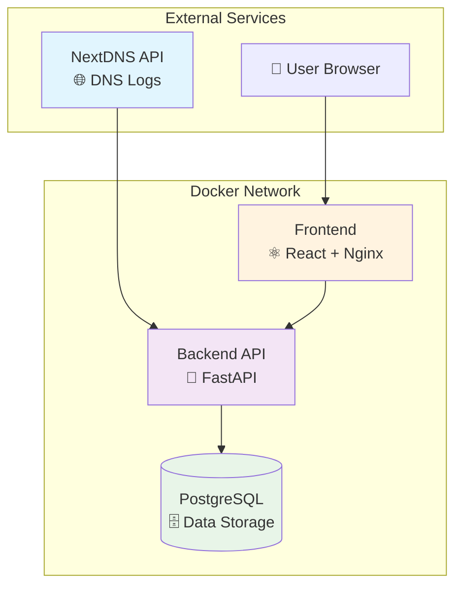

## 🐳 Container Architecture

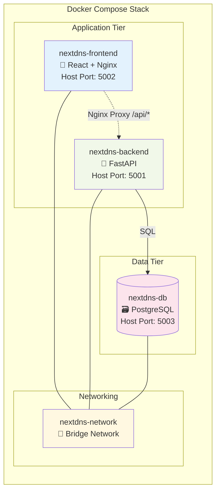

## 📊 Data Flow Architecture

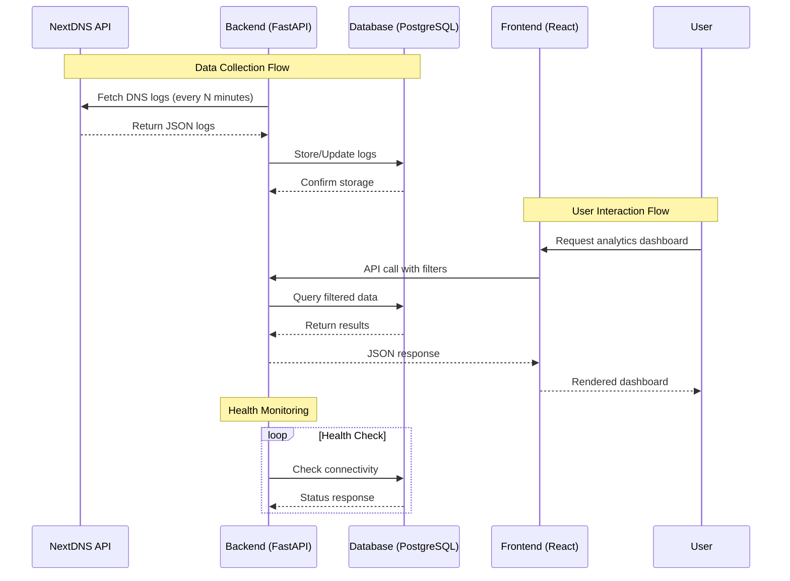

## 🧩 Component Details

### **Backend API (FastAPI)**

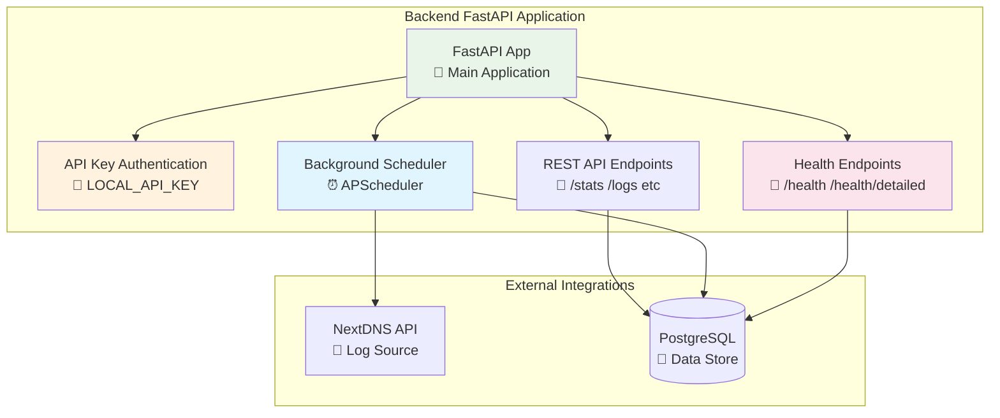

**Key Responsibilities:**
- 🔌 **REST API Endpoints** - Serve DNS log data with filtering
- 🔄 **Data Fetching** - Automated NextDNS API integration
- 🔐 **Authentication** - Secure API key-based access control
- 🏥 **Health Monitoring** - System health and resource metrics
- 📊 **Data Processing** - Log parsing and analytics computation

### **Frontend Dashboard (React/TypeScript)**

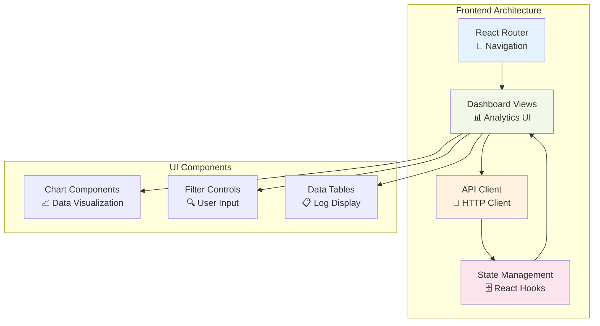

**Key Responsibilities:**
- 📱 **Responsive UI** - Modern React-based interface
- 📊 **Data Visualization** - Charts and analytics displays
- 🔍 **Advanced Filtering** - Domain exclusion and time-range filtering
- 🔌 **API Integration** - Seamless backend communication
- 🎨 **User Experience** - Intuitive navigation and controls

### **Database Layer (PostgreSQL)**

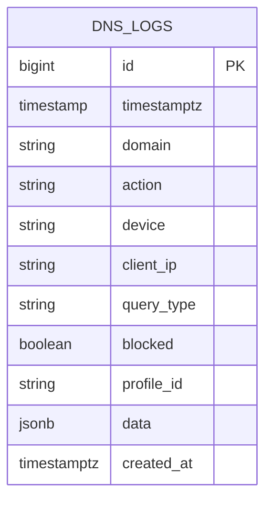

**Key Responsibilities:**
- 💾 **Data Persistence** - Long-term DNS log storage with JSON metadata
- 🔍 **Query Performance** - Optimized indexes on domain, timestamp, profile_id
- 🔄 **Data Integrity** - ACID compliance and duplicate prevention
- 📊 **Analytics Support** - Efficient aggregation queries for dashboard metrics
- 🗂️ **Schema Management** - Alembic-based migrations for version control

**Note:** System metrics (CPU, memory, disk) are collected in real-time via the `/health/detailed` endpoint using `psutil` - they are not persisted to the database.

## 🌐 Network Architecture

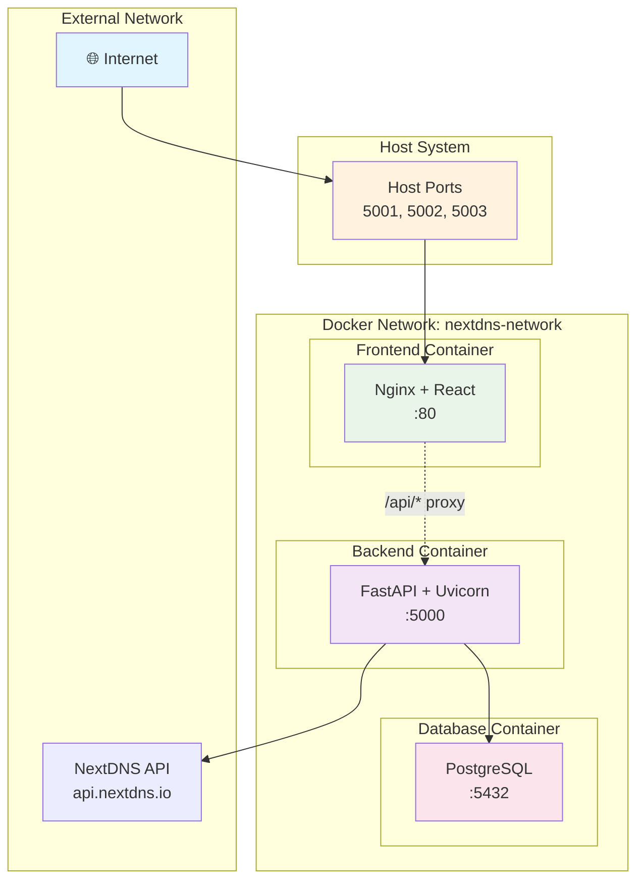

## 📦 Deployment Patterns

### **Docker Compose Deployment**

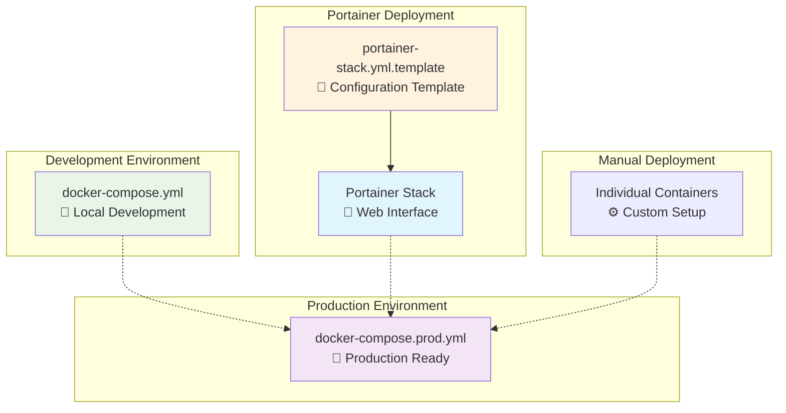

## 🔄 Data Processing Pipeline

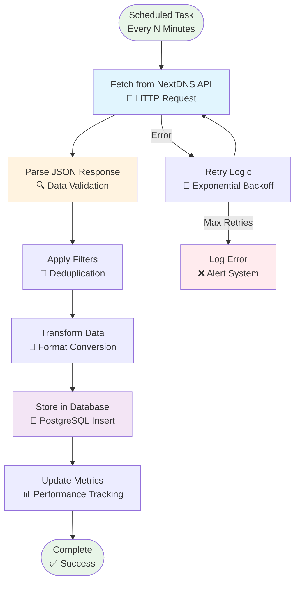

## 🏥 Health Monitoring Architecture

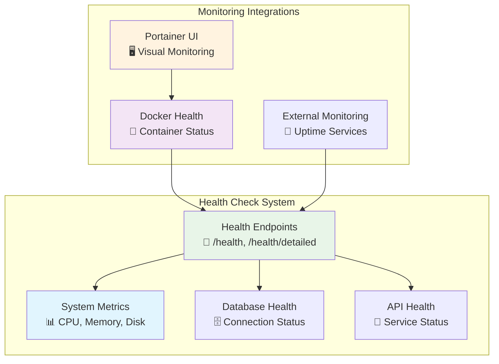

## 🔐 Security Architecture

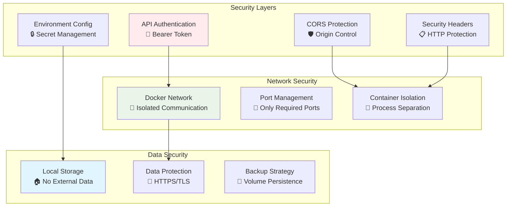

## 🚀 Scalability Considerations

The current architecture is designed for single-instance deployment with the following scaling options:

- **Vertical Scaling**: Increase CPU/memory resources for containers
- **Database Optimization**: Tune PostgreSQL performance and add indexes  
- **Caching**: Add Redis for frequently accessed data
- **CDN**: Serve static frontend assets via CDN for global distribution

## 📏 Performance Characteristics

| Component | Response Time | Throughput | Resource Usage |
|-----------|---------------|------------|----------------|
| **Backend API** | < 100ms | 1000+ req/min | Low CPU, Moderate Memory |
| **Database** | < 50ms (queries) | 10K+ ops/min | Moderate CPU, High I/O |
| **Frontend** | < 2s (load) | Static serving | Minimal resources |
| **Data Fetching** | 1-5s (NextDNS) | Configurable interval | Low background load |

---

**Next:** [API Reference](./03-api-reference.md) → Detailed endpoint documentation