# 03 - API Reference

## 🔌 FastAPI Backend

NextDNS Optimized Analytics provides a comprehensive REST API built with FastAPI, featuring automatic OpenAPI documentation, type safety, and modern async capabilities.

## 📋 API Overview

```mermaid
graph TB
    subgraph "API Endpoints"
        Public[Public Endpoints<br/>🌐 No Auth Required]
        Protected[Protected Endpoints<br/>🔐 Auth Required]
    end
    
    subgraph "Public Endpoints"
        Root[GET /<br/>📊 Basic Info]
        Health[GET /health<br/>🏥 Simple Health]
        HealthDetailed[GET /health/detailed<br/>🔍 System Metrics]
        Docs[GET /docs<br/>📚 Swagger UI]
        ReDoc[GET /redoc<br/>📖 ReDoc UI]
    end
    
    subgraph "Protected Endpoints"
        Stats[GET /stats<br/>📊 Database Stats]
        Logs[GET /logs<br/>📝 DNS Log Data]
        LogsStats[GET /logs/stats<br/>📈 Log Statistics]
        Profiles[GET /profiles<br/>🧱 Profile Management]
        StatsOverview[GET /stats/overview<br/>📊 Overview Stats]
        StatsTimeseries[GET /stats/timeseries<br/>📈 Time Series]
        StatsDomains[GET /stats/domains<br/>🌐 Top Domains]
        StatsTlds[GET /stats/tlds<br/>🏷️ TLD Aggregation]
        StatsDevices[GET /stats/devices<br/>📱 Device Analytics]
    end
    
    Public --> Root
    Public --> Health
    Public --> HealthDetailed
    Public --> Docs
    Public --> ReDoc
    
    Protected --> Stats
    Protected --> Logs
    Protected --> LogsStats
    Protected --> Profiles
    Protected --> StatsOverview
    Protected --> StatsTimeseries
    Protected --> StatsDomains
    Protected --> StatsTlds
    Protected --> StatsDevices
    
    style Public fill:#e8f5e8
    style Protected fill:#ffebee
```



## 🔐 Authentication

All protected endpoints require API key authentication via one of these methods:

1. **Bearer Token**: `Authorization: Bearer YOUR_API_KEY`
2. **X-API-Key Header**: `X-API-Key: YOUR_API_KEY`

The API key is configured via the `LOCAL_API_KEY` environment variable.

```bash
# Using Bearer token
curl -H "Authorization: Bearer your_api_key" http://localhost:5001/stats

# Using X-API-Key header
curl -H "X-API-Key: your_api_key" http://localhost:5001/logs
```

## 🌐 Public Endpoints

### **Root Information**
`GET /`

Returns basic API information and system status.

**Response:**
```json
{
  "message": "NextDNS Optimized Analytics API",
  "version": "2.0.0",
  "status": "running",
  "total_dns_records": 1523
}
```

### **Interactive Documentation**
- **Swagger UI**: `GET /docs` - Interactive API testing interface
- **ReDoc**: `GET /redoc` - Alternative documentation interface

## 🏥 Health Endpoints

### **Simple Health Check**
`GET /health`

**Description:** Basic health check for monitoring systems and load balancers.

**Response Model:**
```json
{
  "status": "healthy|unhealthy",
  "healthy": boolean
}
```

**Example Response:**
```json
{
  "status": "healthy",
  "healthy": true
}
```

**Use Cases:**
- Load balancer health checks
- Basic monitoring systems  
- Container orchestration health probes
- Quick status verification

### **Detailed Health Check**
`GET /health/detailed`

**Description:** Comprehensive health check with system information and resource monitoring.

**Response Model:**
```json
{
  "status_api": "healthy|unhealthy",
  "status_db": "healthy|unhealthy", 
  "healthy": boolean,
  "total_dns_records": integer,
  "fetch_interval_minutes": integer,
  "log_level": "DEBUG|INFO|WARNING|ERROR|CRITICAL",
  "system_resources": {
    "cpu_percent": float,
    "memory_total": integer,
    "memory_available": integer,
    "memory_percent": float,
    "disk_total": integer,
    "disk_used": integer,
    "disk_percent": float,
    "uptime_seconds": float
  },
  "server_info": {
    "platform": "Linux|Darwin|Windows",
    "platform_release": string,
    "architecture": string,
    "hostname": string,
    "python_version": string,
    "cpu_count": integer,
    "cpu_count_logical": integer,
    "frontend_stack": {
      "framework": "React 19.1.1",
      "build_tool": "Vite 7.1.6",
      "language": "TypeScript 5.5.3",
      "styling": "Tailwind CSS 3.4.0"
    }
  },
  "timestamp": "ISO 8601 timestamp"
}
```

**Example Response:**
```json
{
  "status_api": "healthy",
  "status_db": "healthy",
  "healthy": true,
  "total_dns_records": 1523,
  "fetch_interval_minutes": 1,
  "log_level": "DEBUG",
  "system_resources": {
    "cpu_percent": 0.1,
    "memory_total": 8218316800,
    "memory_available": 6324994048,
    "memory_percent": 23.0,
    "disk_total": 62671097856,
    "disk_used": 26991333376,
    "disk_percent": 43.07,
    "uptime_seconds": 188855.04
  },
  "server_info": {
    "platform": "Linux",
    "platform_release": "6.10.14-linuxkit",
    "architecture": "aarch64",
    "hostname": "backend-container",
    "python_version": "3.13.0",
    "cpu_count": 8,
    "cpu_count_logical": 8,
    "frontend_stack": {
      "framework": "React 19.1.1",
      "build_tool": "Vite 7.1.6",
      "language": "TypeScript 5.5.3",
      "styling": "Tailwind CSS 3.4.0"
    }
  },
  "timestamp": "2025-09-20T08:00:00.000000+00:00"
}
```

## 🔒 Protected Endpoints

### **Database Statistics**
`GET /stats`

**Authentication:** Required  
**Description:** Database record counts and system statistics.

**Response Model:**
```json
{
  "total_records": integer,
  "message": string
}
```

**Example:**
```bash
curl -u admin:your_api_key http://localhost:5001/stats
```

**Response:**
```json
{
  "total_records": 1523,
  "message": "Database contains 1523 DNS log records"
}
```

### **DNS Logs Query**
`GET /logs`

**Authentication:** Required  
**Description:** Retrieve DNS logs with advanced filtering capabilities.

**Query Parameters:**
|| Parameter | Type | Default | Description |
||-----------|------|---------|-------------|
|| `limit` | integer | 100 | Maximum number of records to return |
|| `offset` | integer | 0 | Number of records to skip (pagination) |
|| `time_range` | string | all | Time range: **30m**, **1h**, **6h**, **24h**, **7d**, **30d**, **3m**, **all** |
|| `search` | string | - | Search query for domain names |
|| `status` | string | all | Filter by status: all, blocked, allowed |
|| `profile` | string | - | Filter by specific profile ID |
|| `exclude` | string[] | - | Domains to exclude (can be repeated) |

**Example Requests:**
```bash
# Basic query with time range
curl -H "Authorization: Bearer $API_KEY" \
  "http://localhost:5001/logs?limit=10&time_range=1h"

# Advanced filtering with exclusions
curl -H "Authorization: Bearer $API_KEY" \
  "http://localhost:5001/logs?limit=50&exclude=google.com&exclude=apple.com&status=blocked&time_range=6h"

# Real-time monitoring (last 30 minutes)
curl -H "Authorization: Bearer $API_KEY" \
  "http://localhost:5001/logs?time_range=30m&limit=100"

# Search-based query
curl -H "Authorization: Bearer $API_KEY" \
  "http://localhost:5001/logs?search=facebook&time_range=24h"
```

**Response Model:**
```json
{
  "data": [
    {
      "id": integer,
      "timestamp": "ISO 8601 timestamp",
      "domain": string,
      "action": "blocked|allowed",
      "device": {
        "name": string,
        "id": string,
        "local_ip": string
      },
      "client_ip": string,
      "query_type": string,
      "blocked": boolean,
      "profile_id": string,
      "data": object,
      "created_at": "ISO 8601 timestamp"
    }
  ],
  "total_records": integer,
  "returned_records": integer,
  "excluded_domains": ["domain1.com", "domain2.com"]
}
```

### **Logs Statistics**
`GET /logs/stats`

**Authentication:** Required  
**Description:** Statistical analysis of DNS logs with filtering support.

**Query Parameters:**
|| Parameter | Type | Default | Description |
||-----------|------|---------|-------------|
|| `profile` | string | - | Filter statistics by specific profile ID |
|| `time_range` | string | all | Time range: **30m**, **1h**, **6h**, **24h**, **7d**, **30d**, **3m**, **all** |

**Response Model:**
```json
{
  "total": integer,
  "blocked": integer,
  "allowed": integer,
  "blocked_percentage": float,
  "allowed_percentage": float,
  "profile_id": string
}
```

**Example:**
```bash
# Get stats for last 6 hours
curl -H "Authorization: Bearer $API_KEY" \
  "http://localhost:5001/logs/stats?time_range=6h"

# Get stats for specific profile over 3 months
curl -H "Authorization: Bearer $API_KEY" \
  "http://localhost:5001/logs/stats?profile=68416b&time_range=3m"
```

**Response:**
```json
{
  "total": 1523,
  "blocked": 234,
  "allowed": 1289,
  "blocked_percentage": 15.37,
  "allowed_percentage": 84.63,
  "profile_id": "68416b"
}
```

### **Profile Management**
`GET /profiles`

**Authentication:** Required  
**Description:** Get list of available profiles with record counts and activity.

**Response Model:**
```json
{
  "profiles": [
    {
      "profile_id": string,
      "record_count": integer,
      "last_activity": "ISO 8601 timestamp"
    }
  ],
  "total_profiles": integer
}
```

### **Profile Information**
`GET /profiles/info`

**Authentication:** Required  
**Description:** Get detailed information for all configured profiles from NextDNS API.

**Response Model:**
```json
{
  "profiles": {
    "profile_id": {
      "id": string,
      "name": string,
      "fingerprint": string,
      "created": "ISO 8601 timestamp",
      "updated": "ISO 8601 timestamp"
    }
  },
  "total_profiles": integer
}
```

## ⏰ Time Range Options

All statistics endpoints support flexible time range filtering for granular analysis. The system automatically selects appropriate data granularity based on the selected time range.

### **Available Time Ranges**

|| Time Range | Duration | Granularity | Data Points | Use Case |
||------------|----------|-------------|-------------|----------|
|| `30m` | 30 minutes | **1 minute** | 30 | Real-time monitoring |
|| `1h` | 1 hour | **5 minutes** | 12 | Short-term analysis |
|| `6h` | 6 hours | **15 minutes** | 24 | Medium-term trends |
|| `24h` | 24 hours | **1 hour** | 24 | Daily analysis |
|| `7d` | 7 days | **1 day** | 7 | Weekly patterns |
|| `30d` | 30 days | **1 day** | 30 | Monthly overview |
|| `3m` | 3 months | **1 week** | 13 | Long-term trends |
|| `all` | All available data | **1 week** | Variable | Complete history |

### **Time Range Examples**

```bash
# Real-time monitoring (last 30 minutes)
curl -H "Authorization: Bearer $API_KEY" \
  "http://localhost:5001/stats/timeseries?time_range=30m"

# Medium-term analysis (last 6 hours) 
curl -H "Authorization: Bearer $API_KEY" \
  "http://localhost:5001/stats/overview?time_range=6h"

# Long-term trend analysis (last 3 months)
curl -H "Authorization: Bearer $API_KEY" \
  "http://localhost:5001/stats/domains?time_range=3m&limit=20"
```

### **Granularity Benefits**

- **High-frequency data** (30m, 1h, 6h): Perfect for troubleshooting, real-time monitoring, and immediate issue detection
- **Balanced data** (24h, 7d): Ideal for daily patterns, weekly trends, and routine analysis
- **Aggregated data** (30d, 3m, all): Excellent for long-term planning, capacity analysis, and historical insights

## 📈 Statistics Endpoints

### **Stats Overview**
`GET /stats/overview`

**Authentication:** Required  
**Description:** Get dashboard overview statistics.

**Query Parameters:**
|| Parameter | Type | Default | Description |
||-----------|------|---------|-------------|
|| `profile` | string | - | Filter by specific profile ID |
|| `time_range` | string | 24h | Time range: **30m**, **1h**, **6h**, **24h**, **7d**, **30d**, **3m**, **all** |

**Response Model:**
```json
{
  "total_queries": integer,
  "blocked_queries": integer,
  "allowed_queries": integer,
  "blocked_percentage": float,
  "queries_per_hour": float,
  "most_active_device": string,
  "top_blocked_domain": string
}
```

**Examples:**
```bash
# Real-time overview (30 minutes)
curl -H "Authorization: Bearer $API_KEY" \
  "http://localhost:5001/stats/overview?time_range=30m"

# Daily overview for specific profile
curl -H "Authorization: Bearer $API_KEY" \
  "http://localhost:5001/stats/overview?profile=68416b&time_range=24h"

# Long-term trend analysis (3 months)
curl -H "Authorization: Bearer $API_KEY" \
  "http://localhost:5001/stats/overview?time_range=3m"
```

### **Time Series Data**
`GET /stats/timeseries`

**Authentication:** Required  
**Description:** Get time series data for charts and analytics.

**Query Parameters:**
|| Parameter | Type | Default | Description |
||-----------|------|---------|-------------|
|| `profile` | string | - | Filter by specific profile ID |
|| `time_range` | string | 24h | Time range: **30m**, **1h**, **6h**, **24h**, **7d**, **30d**, **3m**, **all** |
|| `granularity` | string | auto | Data granularity: **1min**, **5min**, **15min**, **hour**, **day**, **week** |

**Response Model:**
```json
{
  "data": [
    {
      "timestamp": "ISO 8601 timestamp",
      "total_queries": integer,
      "blocked_queries": integer,
      "allowed_queries": integer
    }
  ],
  "granularity": string,
  "total_points": integer
}
```

### **Top Domains**
`GET /stats/domains`

**Authentication:** Required  
**Description:** Get top blocked and allowed domains.

**Query Parameters:**
|| Parameter | Type | Default | Description |
||-----------|------|---------|-------------|
|| `profile` | string | - | Filter by specific profile ID |
|| `time_range` | string | 24h | Time range: **30m**, **1h**, **6h**, **24h**, **7d**, **30d**, **3m**, **all** |
|| `limit` | integer | 10 | Number of top domains to return (5-50) |

**Response Model:**
```json
{
  "blocked_domains": [
    {
      "domain": string,
      "count": integer,
      "percentage": float
    }
  ],
  "allowed_domains": [
    {
      "domain": string,
      "count": integer,
      "percentage": float
    }
  ]
}
```

### **🏷️ TLD Aggregation (NEW)**
`GET /stats/tlds`

**Authentication:** Required  
**Description:** Get top-level domain statistics with subdomain aggregation.

**Features:**
- Groups subdomains under parent domains
- `gateway.icloud.com` → `icloud.com`
- `bag.itunes.apple.com` → `apple.com`
- Provides higher-level traffic insights

**Query Parameters:**
|| Parameter | Type | Default | Description |
||-----------|------|---------|-------------|
|| `profile` | string | - | Filter by specific profile ID |
|| `time_range` | string | 24h | Time range: **30m**, **1h**, **6h**, **24h**, **7d**, **30d**, **3m**, **all** |
|| `limit` | integer | 10 | Number of top TLDs to return (5-50) |

**Response Model:**
```json
{
  "blocked_tlds": [
    {
      "domain": string,
      "count": integer,
      "percentage": float
    }
  ],
  "allowed_tlds": [
    {
      "domain": string,
      "count": integer,
      "percentage": float
    }
  ]
}
```

**Example:**
```bash
curl -H "Authorization: Bearer your_api_key" \
  "http://localhost:5001/stats/tlds?time_range=24h&limit=10"
```

**Example Response:**
```json
{
  "blocked_tlds": [
    {"domain": "facebook.com", "count": 45, "percentage": 12.3}
  ],
  "allowed_tlds": [
    {"domain": "apple.com", "count": 428, "percentage": 17.9},
    {"domain": "icloud.com", "count": 147, "percentage": 6.1},
    {"domain": "microsoft.com", "count": 118, "percentage": 4.9}
  ]
}
```

### **📱 Device Analytics (NEW)**
`GET /stats/devices`

**Authentication:** Required  
**Description:** Get device usage statistics showing DNS query activity by device.

**Features:**
- Shows which devices generate most DNS traffic
- Breakdown of blocked vs allowed queries per device
- Device exclusion support (useful for "Unidentified Device")
- Last activity tracking

**Query Parameters:**
|| Parameter | Type | Default | Description |
||-----------|------|---------|-------------|
|| `profile` | string | - | Filter by specific profile ID |
|| `time_range` | string | 24h | Time range: **30m**, **1h**, **6h**, **24h**, **7d**, **30d**, **3m**, **all** |
|| `limit` | integer | 10 | Number of top devices to return (5-50) |
|| `exclude` | string[] | - | Device names to exclude (can be repeated) |

**Response Model:**
```json
{
  "devices": [
    {
      "device_name": string,
      "total_queries": integer,
      "blocked_queries": integer,
      "allowed_queries": integer,
      "blocked_percentage": float,
      "allowed_percentage": float,
      "last_activity": "ISO 8601 timestamp"
    }
  ]
}
```

**Example:**
```bash
# Get top 5 devices, excluding unidentified ones
curl -H "Authorization: Bearer your_api_key" \
  "http://localhost:5001/stats/devices?time_range=24h&limit=5&exclude=Unidentified%20Device"
```

**Example Response:**
```json
{
  "devices": [
    {
      "device_name": "Martins iPhone 16 PRO",
      "total_queries": 583,
      "blocked_queries": 12,
      "allowed_queries": 571,
      "blocked_percentage": 2.1,
      "allowed_percentage": 97.9,
      "last_activity": "2025-09-21T19:28:41.812000+00:00"
    },
    {
      "device_name": "MacBook M1 Pro",
      "total_queries": 489,
      "blocked_queries": 0,
      "allowed_queries": 489,
      "blocked_percentage": 0.0,
      "allowed_percentage": 100.0,
      "last_activity": "2025-09-21T19:28:52.093000+00:00"
    }
  ]
}
```

**Use Cases:**
- Network monitoring and device activity tracking
- Identify devices with unusual DNS patterns
- Troubleshoot connectivity issues
- Monitor IoT device behavior
- Family usage tracking

## 📊 Response Field Explanations

### **Health Check Fields**

| Field | Description |
|-------|-------------|
| `status_api` | API server health status |
| `status_db` | Database connection health |
| `healthy` | Overall system health boolean |
| `total_dns_records` | Total DNS log records in database |
| `fetch_interval_minutes` | Configured API fetch interval |
| `system_resources` | CPU, memory, disk utilization |
| `server_info` | Platform, architecture, versions |

### **DNS Log Fields**

| Field | Description |
|-------|-------------|
| `id` | Unique record identifier |
| `timestamp` | When DNS query occurred |
| `domain` | Queried domain name |
| `action` | NextDNS action (blocked/allowed) |
| `device` | Device information when available |
| `client_ip` | Source IP address |
| `query_type` | DNS record type (A, AAAA, CNAME, etc.) |
| `blocked` | Boolean indicating if query was blocked |
| `profile_id` | NextDNS profile identifier |
| `data` | Additional metadata from NextDNS |
| `created_at` | When record was stored locally |

## 🔧 Usage Examples

### **Health Monitoring Scripts**

```bash
#!/bin/bash
# Simple health check script

HEALTH=$(curl -s http://localhost:5001/health)
STATUS=$(echo $HEALTH | jq -r '.status')

if [ "$STATUS" = "healthy" ]; then
    echo "✅ System is healthy"
    exit 0
else
    echo "❌ System is unhealthy"
    exit 1
fi
```

### **Advanced Analytics Query**

```bash
#!/bin/bash
# Get blocked domains in the last 24 hours

API_KEY="your_api_key_here"
START_DATE=$(date -u -d "24 hours ago" +"%Y-%m-%dT%H:%M:%SZ")

curl -H "Authorization: Bearer $API_KEY" \
  "http://localhost:5001/logs?action=blocked&start_date=$START_DATE&limit=100" \
  | jq '.data[] | .domain' \
  | sort | uniq -c | sort -nr
```

### **Data Export Example**

```python
import requests
from datetime import datetime, timedelta
import csv

API_BASE = "http://localhost:5001"
API_KEY = "your_api_key_here"

# Get logs from last week
end_date = datetime.utcnow()
start_date = end_date - timedelta(days=7)

params = {
    "start_date": start_date.isoformat() + "Z",
    "end_date": end_date.isoformat() + "Z",
    "limit": 1000
}

response = requests.get(
    f"{API_BASE}/logs",
    params=params,
    headers={"Authorization": f"Bearer {API_KEY}"}
)

# Export to CSV
if response.status_code == 200:
    data = response.json()["data"]
    
    with open("dns_logs.csv", "w", newline="") as csvfile:
        fieldnames = ["timestamp", "domain", "action", "query_type"]
        writer = csv.DictWriter(csvfile, fieldnames=fieldnames)
        
        writer.writeheader()
        for log in data:
            writer.writerow({
                "timestamp": log["timestamp"],
                "domain": log["domain"], 
                "action": log["action"],
                "query_type": log["query_type"]
            })
```

## 🚨 Error Handling

### **Common HTTP Status Codes**

| Status | Description |
|--------|-------------|
| `200` | Success |
| `400` | Bad Request - Invalid parameters |
| `401` | Unauthorized - Invalid/missing API key |
| `404` | Not Found - Endpoint doesn't exist |
| `422` | Unprocessable Entity - Validation error |
| `500` | Internal Server Error - System issue |
| `503` | Service Unavailable - System unhealthy |

### **Error Response Format**

```json
{
  "detail": "Error description",
  "status_code": 400,
  "timestamp": "2025-09-20T08:00:00.000000Z"
}
```

## 📈 Performance Considerations

### **Query Optimization**

- Use `limit` parameter to control response size
- Implement pagination with `offset` for large datasets
- Date range filtering is more efficient than large limit values
- Domain exclusion is processed server-side for better performance

### **Rate Limiting**

- No explicit rate limits currently implemented
- Consider implementing client-side throttling for bulk operations
- Health endpoints can be called frequently without concerns

### **Caching**

- Health check responses are not cached
- Log queries are executed fresh each time
- Consider implementing client-side caching for dashboard applications

---

**Next:** [Deployment Guide](./04-deployment.md) → Setting up your infrastructure