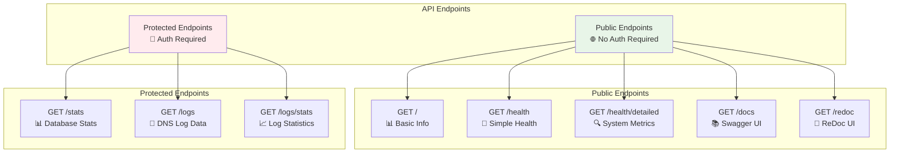

# 03 - API Reference

## 🔌 FastAPI Backend

NextDNS Optimized Analytics provides a comprehensive REST API built with FastAPI, featuring automatic OpenAPI documentation, type safety, and modern async capabilities.

## 📋 API Overview



## 🔐 Authentication

All protected endpoints require HTTP Basic Authentication:

- **Username**: `admin`
- **Password**: `LOCAL_API_KEY` environment variable

```bash
# Using curl with authentication
curl -u admin:your_api_key http://localhost:5002/stats

# Using Authorization header
curl -H "Authorization: Bearer your_api_key" http://localhost:5002/logs
```

## 🌐 Public Endpoints

### **Root Information**
`GET /`

Returns basic API information and system status.

**Response:**
```json
{
  "message": "NextDNS Optimized Analytics API",
  "version": "2.0.0",
  "status": "running",
  "total_dns_records": 1523
}
```

### **Interactive Documentation**
- **Swagger UI**: `GET /docs` - Interactive API testing interface
- **ReDoc**: `GET /redoc` - Alternative documentation interface

## 🏥 Health Endpoints

### **Simple Health Check**
`GET /health`

**Description:** Basic health check for monitoring systems and load balancers.

**Response Model:**
```json
{
  "status": "healthy|unhealthy",
  "healthy": boolean
}
```

**Example Response:**
```json
{
  "status": "healthy",
  "healthy": true
}
```

**Use Cases:**
- Load balancer health checks
- Basic monitoring systems  
- Container orchestration health probes
- Quick status verification

### **Detailed Health Check**
`GET /health/detailed`

**Description:** Comprehensive health check with system information and resource monitoring.

**Response Model:**
```json
{
  "status_api": "healthy|unhealthy",
  "status_db": "healthy|unhealthy", 
  "healthy": boolean,
  "total_dns_records": integer,
  "fetch_interval_minutes": integer,
  "log_level": "DEBUG|INFO|WARNING|ERROR|CRITICAL",
  "system_resources": {
    "cpu_percent": float,
    "memory_total": integer,
    "memory_available": integer,
    "memory_percent": float,
    "disk_total": integer,
    "disk_used": integer,
    "disk_percent": float,
    "uptime_seconds": float
  },
  "server_info": {
    "platform": "Linux|Darwin|Windows",
    "platform_release": string,
    "architecture": string,
    "hostname": string,
    "python_version": string,
    "cpu_count": integer,
    "cpu_count_logical": integer,
    "frontend_stack": {
      "framework": "React 19.1.1",
      "build_tool": "Vite 7.1.6",
      "language": "TypeScript 5.5.3",
      "styling": "Tailwind CSS 3.4.0"
    }
  },
  "timestamp": "ISO 8601 timestamp"
}
```

**Example Response:**
```json
{
  "status_api": "healthy",
  "status_db": "healthy",
  "healthy": true,
  "total_dns_records": 1523,
  "fetch_interval_minutes": 1,
  "log_level": "DEBUG",
  "system_resources": {
    "cpu_percent": 0.1,
    "memory_total": 8218316800,
    "memory_available": 6324994048,
    "memory_percent": 23.0,
    "disk_total": 62671097856,
    "disk_used": 26991333376,
    "disk_percent": 43.07,
    "uptime_seconds": 188855.04
  },
  "server_info": {
    "platform": "Linux",
    "platform_release": "6.10.14-linuxkit",
    "architecture": "aarch64",
    "hostname": "backend-container",
    "python_version": "3.13.0",
    "cpu_count": 8,
    "cpu_count_logical": 8,
    "frontend_stack": {
      "framework": "React 19.1.1",
      "build_tool": "Vite 7.1.6",
      "language": "TypeScript 5.5.3",
      "styling": "Tailwind CSS 3.4.0"
    }
  },
  "timestamp": "2025-09-20T08:00:00.000000+00:00"
}
```

## 🔒 Protected Endpoints

### **Database Statistics**
`GET /stats`

**Authentication:** Required  
**Description:** Database record counts and system statistics.

**Response Model:**
```json
{
  "total_records": integer,
  "message": string
}
```

**Example:**
```bash
curl -u admin:your_api_key http://localhost:5002/stats
```

**Response:**
```json
{
  "total_records": 1523,
  "message": "Database contains 1523 DNS log records"
}
```

### **DNS Logs Query**
`GET /logs`

**Authentication:** Required  
**Description:** Retrieve DNS logs with advanced filtering capabilities.

**Query Parameters:**
| Parameter | Type | Default | Description |
|-----------|------|---------|-------------|
| `limit` | integer | 100 | Maximum number of records to return |
| `offset` | integer | 0 | Number of records to skip (pagination) |
| `start_date` | string | - | Start date (ISO format) |
| `end_date` | string | - | End date (ISO format) |
| `exclude` | string[] | - | Domains to exclude (can be repeated) |
| `domain` | string | - | Filter by specific domain |
| `action` | string | - | Filter by action (blocked/allowed) |
| `query_type` | string | - | Filter by DNS query type (A, AAAA, etc.) |
| `profile_id` | string | - | Filter by NextDNS profile ID |

**Example Requests:**
```bash
# Basic query with limit
curl -u admin:your_api_key "http://localhost:5002/logs?limit=10"

# Advanced filtering
curl -u admin:your_api_key \
  "http://localhost:5002/logs?limit=50&exclude=google.com&exclude=apple.com&action=blocked"

# Date range query
curl -u admin:your_api_key \
  "http://localhost:5002/logs?start_date=2025-09-19T00:00:00Z&end_date=2025-09-20T00:00:00Z"

# Domain-specific query
curl -u admin:your_api_key \
  "http://localhost:5002/logs?domain=facebook.com&query_type=A"
```

**Response Model:**
```json
{
  "data": [
    {
      "id": integer,
      "timestamp": "ISO 8601 timestamp",
      "domain": string,
      "action": "blocked|allowed",
      "device": {
        "name": string,
        "id": string,
        "local_ip": string
      },
      "client_ip": string,
      "query_type": string,
      "blocked": boolean,
      "profile_id": string,
      "data": object,
      "created_at": "ISO 8601 timestamp"
    }
  ],
  "total_records": integer,
  "returned_records": integer,
  "excluded_domains": ["domain1.com", "domain2.com"]
}
```

### **Logs Statistics**
`GET /logs/stats`

**Authentication:** Required  
**Description:** Statistical analysis of DNS logs with filtering support.

**Query Parameters:**
Same filtering parameters as `/logs` endpoint.

**Response Model:**
```json
{
  "total": integer,
  "blocked": integer,
  "allowed": integer,
  "blocked_percentage": float,
  "allowed_percentage": float,
  "profile_id": string
}
```

**Example:**
```bash
curl -u admin:your_api_key \
  "http://localhost:5002/logs/stats?start_date=2025-09-19T00:00:00Z"
```

**Response:**
```json
{
  "total": 1523,
  "blocked": 234,
  "allowed": 1289,
  "blocked_percentage": 15.37,
  "allowed_percentage": 84.63,
  "profile_id": "68416b"
}
```

## 📊 Response Field Explanations

### **Health Check Fields**

| Field | Description |
|-------|-------------|
| `status_api` | API server health status |
| `status_db` | Database connection health |
| `healthy` | Overall system health boolean |
| `total_dns_records` | Total DNS log records in database |
| `fetch_interval_minutes` | Configured API fetch interval |
| `system_resources` | CPU, memory, disk utilization |
| `server_info` | Platform, architecture, versions |

### **DNS Log Fields**

| Field | Description |
|-------|-------------|
| `id` | Unique record identifier |
| `timestamp` | When DNS query occurred |
| `domain` | Queried domain name |
| `action` | NextDNS action (blocked/allowed) |
| `device` | Device information when available |
| `client_ip` | Source IP address |
| `query_type` | DNS record type (A, AAAA, CNAME, etc.) |
| `blocked` | Boolean indicating if query was blocked |
| `profile_id` | NextDNS profile identifier |
| `data` | Additional metadata from NextDNS |
| `created_at` | When record was stored locally |

## 🔧 Usage Examples

### **Health Monitoring Scripts**

```bash
#!/bin/bash
# Simple health check script

HEALTH=$(curl -s http://localhost:5002/health)
STATUS=$(echo $HEALTH | jq -r '.status')

if [ "$STATUS" = "healthy" ]; then
    echo "✅ System is healthy"
    exit 0
else
    echo "❌ System is unhealthy"
    exit 1
fi
```

### **Advanced Analytics Query**

```bash
#!/bin/bash
# Get blocked domains in the last 24 hours

API_KEY="your_api_key_here"
START_DATE=$(date -u -d "24 hours ago" +"%Y-%m-%dT%H:%M:%SZ")

curl -u admin:$API_KEY \
  "http://localhost:5002/logs?action=blocked&start_date=$START_DATE&limit=100" \
  | jq '.data[] | .domain' \
  | sort | uniq -c | sort -nr
```

### **Data Export Example**

```python
import requests
from datetime import datetime, timedelta
import csv

API_BASE = "http://localhost:5002"
API_KEY = "your_api_key_here"

# Get logs from last week
end_date = datetime.utcnow()
start_date = end_date - timedelta(days=7)

params = {
    "start_date": start_date.isoformat() + "Z",
    "end_date": end_date.isoformat() + "Z",
    "limit": 1000
}

response = requests.get(
    f"{API_BASE}/logs",
    params=params,
    auth=("admin", API_KEY)
)

# Export to CSV
if response.status_code == 200:
    data = response.json()["data"]
    
    with open("dns_logs.csv", "w", newline="") as csvfile:
        fieldnames = ["timestamp", "domain", "action", "query_type"]
        writer = csv.DictWriter(csvfile, fieldnames=fieldnames)
        
        writer.writeheader()
        for log in data:
            writer.writerow({
                "timestamp": log["timestamp"],
                "domain": log["domain"], 
                "action": log["action"],
                "query_type": log["query_type"]
            })
```

## 🚨 Error Handling

### **Common HTTP Status Codes**

| Status | Description |
|--------|-------------|
| `200` | Success |
| `400` | Bad Request - Invalid parameters |
| `401` | Unauthorized - Invalid/missing API key |
| `404` | Not Found - Endpoint doesn't exist |
| `422` | Unprocessable Entity - Validation error |
| `500` | Internal Server Error - System issue |
| `503` | Service Unavailable - System unhealthy |

### **Error Response Format**

```json
{
  "detail": "Error description",
  "status_code": 400,
  "timestamp": "2025-09-20T08:00:00.000000Z"
}
```

## 📈 Performance Considerations

### **Query Optimization**

- Use `limit` parameter to control response size
- Implement pagination with `offset` for large datasets
- Date range filtering is more efficient than large limit values
- Domain exclusion is processed server-side for better performance

### **Rate Limiting**

- No explicit rate limits currently implemented
- Consider implementing client-side throttling for bulk operations
- Health endpoints can be called frequently without concerns

### **Caching**

- Health check responses are not cached
- Log queries are executed fresh each time
- Consider implementing client-side caching for dashboard applications

---

**Next:** [Deployment Guide](./04-deployment.md) → Setting up your infrastructure