# 04 - Deployment

## 🚀 Deployment Options

NextDNS Optimized Analytics supports multiple deployment methods to fit different infrastructure needs and expertise levels.

```mermaid
graph TB
    subgraph "Deployment Methods"
        Docker[Docker Compose<br/>🐳 Recommended]
        Portainer[Portainer Stack<br/>🖥️ Web Interface]
        Manual[Manual Setup<br/>⚙️ Custom Deployment]
    end
    
    subgraph "Environments"
        Dev[Development<br/>🔧 Local Testing]
        Prod[Production<br/>🚀 Live System]
        Demo[Demo/Staging<br/>🎭 Preview]
    end
    
    Docker --> Dev
    Docker --> Prod
    Portainer --> Prod
    Manual --> Prod
    
    style Docker fill:#e8f5e8
    style Portainer fill:#e1f5fe
    style Manual fill:#fff3e0
```



## 🐳 Docker Compose (Recommended)

### Quick Start
```bash
# Clone repository
git clone https://github.com/BondIT-ApS/NextDNS-Optimized-Analytics.git
cd NextDNS-Optimized-Analytics

# Configure environment
cp config/.env.template config/.env
# Edit config/.env with your settings

# Deploy
docker-compose up -d
```

### Full Docker Compose Setup

**Prerequisites:**
- Docker Engine 24.0+
- Docker Compose v2.0+
- NextDNS API key
- 2GB RAM minimum, 4GB recommended

**Step-by-step:**

1. **Environment Configuration**
```bash
# Copy template
cp config/.env.template config/.env

# Edit configuration
nano config/.env
```

2. **Required Environment Variables**
```env
# NextDNS Configuration
API_KEY=your_nextdns_api_key_here
PROFILE_IDS=profile1,profile2,profile3

# Local API Authentication
LOCAL_API_KEY=your_secure_api_key_here

# Database Configuration
POSTGRES_USER=nextdns_user
POSTGRES_PASSWORD=your_secure_db_password
POSTGRES_DB=nextdns
POSTGRES_HOST=db
POSTGRES_PORT=5432

# Application Settings
LOG_LEVEL=INFO
FETCH_INTERVAL=60
FETCH_LIMIT=1000
```

3. **Deploy Stack**
```bash
# Start services
docker-compose up -d

# Check status
docker-compose ps

# View logs
docker-compose logs -f
```

4. **Verify Deployment**
```bash
# Check health
curl http://localhost:5002/health

# Check frontend
curl http://localhost:5003

# View API docs
open http://localhost:5002/docs
```

## 🖥️ Portainer Stack Deployment

### Using Template

1. **Prepare Configuration**
```bash
# Copy template to your configuration
cp portainer-stack.yml.template portainer-stack.yml

# Edit with your credentials
nano portainer-stack.yml
```

2. **Deploy in Portainer**
- Login to Portainer Web UI
- Navigate to **Stacks** → **Add stack**
- Choose **Upload** method
- Upload your configured `portainer-stack.yml`
- Click **Deploy the stack**

### Environment Variables Method

For enhanced security, use Portainer's environment variables:

1. **Create Stack** with template content
2. **Add Environment Variables**:
   - `POSTGRES_PASSWORD`
   - `API_KEY`
   - `LOCAL_API_KEY`
   - `PROFILE_IDS`

3. **Reference in Stack**:
```yaml
environment:
  API_KEY: ${API_KEY}
  LOCAL_API_KEY: ${LOCAL_API_KEY}
```

## ⚙️ Manual Deployment

### Individual Containers

**Database:**
```bash
docker run -d \
  --name nextdns-db \
  --network nextdns-network \
  -e POSTGRES_USER=nextdns_user \
  -e POSTGRES_PASSWORD=secure_password \
  -e POSTGRES_DB=nextdns \
  -v nextdns_db_data:/var/lib/postgresql/data \
  postgres:15-alpine
```

**Backend:**
```bash
docker run -d \
  --name nextdns-backend \
  --network nextdns-network \
  --depends-on nextdns-db \
  -e API_KEY=your_nextdns_api_key \
  -e LOCAL_API_KEY=your_local_key \
  -e POSTGRES_HOST=nextdns-db \
  -p 5001:5000 \
  maboni82/nextdns-optimized-analytics-backend:latest
```

**Frontend:**
```bash
docker run -d \
  --name nextdns-frontend \
  --network nextdns-network \
  --depends-on nextdns-backend \
  -e BACKEND_API_URL=http://nextdns-backend:5000/api \
  -p 3000:80 \
  maboni82/nextdns-optimized-analytics-frontend:latest
```

## 📊 Deployment Verification

### Health Check Script
```bash
#!/bin/bash
# deployment-check.sh

echo "🔍 Checking NextDNS Analytics Deployment..."

# Check backend health
BACKEND_STATUS=$(curl -s http://localhost:5002/health | jq -r '.status')
if [ "$BACKEND_STATUS" = "healthy" ]; then
    echo "✅ Backend is healthy"
else
    echo "❌ Backend is unhealthy"
    exit 1
fi

# Check frontend
FRONTEND_STATUS=$(curl -s -o /dev/null -w "%{http_code}" http://localhost:5003)
if [ "$FRONTEND_STATUS" = "200" ]; then
    echo "✅ Frontend is accessible"
else
    echo "❌ Frontend is not accessible"
    exit 1
fi

# Check database records
RECORDS=$(curl -u admin:$LOCAL_API_KEY -s http://localhost:5002/stats | jq -r '.total_records')
echo "📊 Database contains $RECORDS DNS records"

echo "✅ Deployment verification completed successfully!"
```

## 🔧 Production Considerations

### Resource Requirements

| Component | CPU | RAM | Storage |
|-----------|-----|-----|---------|
| **Backend** | 0.5 cores | 512MB | 100MB |
| **Frontend** | 0.1 cores | 128MB | 50MB |
| **Database** | 0.5 cores | 1GB | 10GB+ |
| **Total** | 1.1 cores | 1.6GB | 10GB+ |

### Scaling Recommendations


### Backup Strategy

```bash
#!/bin/bash
# backup-database.sh

BACKUP_DIR="/backups/nextdns-$(date +%Y%m%d)"
mkdir -p $BACKUP_DIR

# Database backup
docker exec nextdns-db pg_dump -U nextdns_user nextdns > $BACKUP_DIR/database.sql

# Configuration backup
cp config/.env $BACKUP_DIR/
cp docker-compose.yml $BACKUP_DIR/

# Archive
tar -czf $BACKUP_DIR.tar.gz $BACKUP_DIR
rm -rf $BACKUP_DIR

echo "Backup completed: $BACKUP_DIR.tar.gz"
```

## 🔄 Updates and Maintenance

### Update Procedure

1. **Backup current deployment**
2. **Pull latest images**:
   ```bash
   docker-compose pull
   ```
3. **Restart services**:
   ```bash
   docker-compose up -d
   ```
4. **Verify health**:
   ```bash
   curl http://localhost:5002/health
   ```

### Monitoring Setup

Integration with monitoring systems:
- **Health endpoints** for uptime monitoring
- **Docker health checks** for container status
- **Log aggregation** for troubleshooting
- **Resource monitoring** for capacity planning

---

**Next:** [Configuration](./05-configuration.md) → Environment variables and settings