# 08 - Security

## 🔐 Security Best Practices

Comprehensive security guide for NextDNS Optimized Analytics deployment.

## 🛡️ Security Architecture

```mermaid
graph TB
    subgraph "Security Layers"
        API[API Authentication<br/>🔐 Bearer Token]
        Network[Network Isolation<br/>🔗 Docker Networks]
        Data[Data Protection<br/>💾 Local Storage]
        Access[Access Control<br/>🚪 Port Management]
    end
    
    subgraph "Threat Mitigation"
        Auth[Authentication<br/>🔑 API Keys]
        CORS[CORS Protection<br/>🛡️ Origin Control]
        Headers[Security Headers<br/>📋 HTTP Protection]
        Encryption[Data Encryption<br/>🔒 TLS/HTTPS]
    end
    
    API --> Auth
    Network --> CORS
    Data --> Encryption
    Access --> Headers
    
    style API fill:#ffebee
    style Network fill:#e8f5e8
    style Data fill:#e1f5fe
    style Access fill:#fff3e0
```



## 🔑 Authentication & Authorization

### JWT-Based Authentication System

The application uses **JWT (JSON Web Tokens)** for secure, stateless authentication with optional enable/disable capability.

**Key Features:**
- Optional authentication (disabled by default for local dev)
- JWT tokens with configurable expiration
- Rate limiting on login endpoint (5 attempts/minute)
- Support for plain text or bcrypt-hashed passwords
- HS256 algorithm for token signing

**Generate Secure Keys:**
```bash
# Generate JWT secret key (minimum 32 characters)
openssl rand -hex 32
# Output: a1b2c3d4e5f6g7h8i9j0k1l2m3n4o5p6q7r8s9t0u1v2w3x4y5z6

# Generate bcrypt password hash
python3 -c "from passlib.hash import bcrypt; print(bcrypt.hash('your_secure_password'))"
# Output: $2b$12$abcdefghijklmnopqrstuvwxyz...

# Or use Python secrets module
python3 -c "import secrets; print(secrets.token_hex(32))"
```

**Environment Variable Security:**
```env
# Authentication Configuration
AUTH_ENABLED=true
AUTH_USERNAME=admin
AUTH_PASSWORD=$2b$12$hashed_password_here_or_plain_text
AUTH_SECRET_KEY=a1b2c3d4e5f6g7h8i9j0k1l2m3n4o5p6q7r8s9t0u1v2w3x4y5z6
AUTH_SESSION_TIMEOUT=60

# External APIs
API_KEY=your_nextdns_api_key_here

# Database
POSTGRES_PASSWORD=very_secure_database_password_here
```

### Access Control

**Network-Level Protection:**
- Docker network isolation
- Minimal port exposure
- Firewall configuration

**Application-Level Protection:**
```python
# Backend implements JWT authentication
from jose import jwt
from passlib.context import CryptContext

pwd_context = CryptContext(schemes=["bcrypt"], deprecated="auto")

def create_access_token(data: dict, expires_delta: timedelta):
    to_encode = data.copy()
    expire = datetime.utcnow() + expires_delta
    to_encode.update({"exp": expire})
    return jwt.encode(to_encode, AUTH_SECRET_KEY, algorithm="HS256")

async def get_current_user(credentials: HTTPAuthorizationCredentials):
    if not AUTH_ENABLED:
        return "anonymous"
    payload = jwt.decode(credentials.credentials, AUTH_SECRET_KEY)
    return payload.get("sub")
```

### Session Management

**JWT Token Lifecycle:**
1. User authenticates with username/password
2. Server issues JWT token with expiration
3. Client includes token in Authorization header
4. Server validates token signature and expiration
5. Token expires after configured timeout
6. User must re-authenticate to get new token

**Best Practices:**
- Set appropriate session timeout (default: 60 minutes)
- Store tokens securely in client (httpOnly cookies or secure storage)
- Implement token refresh mechanism for better UX
- Never expose tokens in URLs or logs
- Rotate AUTH_SECRET_KEY periodically in production

## 🌐 Network Security

### Docker Network Isolation

```yaml
# docker-compose.yml security configuration
networks:
  nextdns-network:
    driver: bridge
    internal: false  # Allow external access only where needed

services:
  backend:
    networks:
      - nextdns-network
    expose:
      - "5000"  # Internal port only
    ports:
      - "5001:5000"  # External access controlled
```

### Port Management

**Recommended Port Configuration:**
```yaml
# Minimal external exposure
ports:
  - "3000:80"    # Frontend (can be behind reverse proxy)
  - "5001:5000"  # Backend API (required for external access)
# Database port NOT exposed externally
```

### Reverse Proxy Setup

**Nginx Configuration:**
```nginx
server {
    listen 443 ssl http2;
    server_name your-domain.com;
    
    # SSL Configuration
    ssl_certificate /path/to/cert.pem;
    ssl_certificate_key /path/to/key.pem;
    
    # Security Headers
    add_header X-Frame-Options "SAMEORIGIN" always;
    add_header X-Content-Type-Options "nosniff" always;
    add_header Referrer-Policy "no-referrer-when-downgrade" always;
    
    # Frontend
    location / {
        proxy_pass http://localhost:5003;
        proxy_set_header Host $host;
        proxy_set_header X-Real-IP $remote_addr;
    }
    
    # Backend API
    location /api/ {
        proxy_pass http://localhost:5001/;
        proxy_set_header Host $host;
        proxy_set_header X-Real-IP $remote_addr;
        
        # Rate limiting
        limit_req zone=api burst=10 nodelay;
    }
}
```

## 💾 Data Security

### Local Data Storage

**Benefits:**
- DNS logs never leave your infrastructure
- No third-party data processing
- Full control over data retention
- GDPR/privacy compliance

**Database Security:**
```env
# Strong database credentials
POSTGRES_USER=nextdns_user
POSTGRES_PASSWORD=use_very_strong_password_here
POSTGRES_DB=nextdns

# Database connection encryption
POSTGRES_SSLMODE=require  # For production deployments
```

### Backup Security

```bash
#!/bin/bash
# secure-backup.sh

BACKUP_DIR="/secure/backups/nextdns-$(date +%Y%m%d)"
mkdir -p $BACKUP_DIR

# Encrypted database backup
docker exec nextdns-db pg_dump -U nextdns_user nextdns | \
  gpg --symmetric --cipher-algo AES256 --output $BACKUP_DIR/database.sql.gpg

# Configuration backup (exclude sensitive data)
grep -v 'PASSWORD\|API_KEY' config/.env > $BACKUP_DIR/config-sanitized.env

echo "Encrypted backup completed: $BACKUP_DIR"
```

## 🔒 Environment Security

### Secret Management

**Development:**
```env
# .env file (never commit to git)
AUTH_ENABLED=false
AUTH_USERNAME=admin
AUTH_PASSWORD=dev_password
AUTH_SECRET_KEY=dev_secret_key_for_local_testing_only
API_KEY=dev_nextdns_key
POSTGRES_PASSWORD=dev_password
```

**Production - Environment Variables:**
```bash
# Set via environment variables
export AUTH_ENABLED="true"
export AUTH_USERNAME="admin"
export AUTH_PASSWORD="$2b$12$very_strong_bcrypt_hashed_password"
export AUTH_SECRET_KEY="production_secret_key_minimum_32_characters"
export API_KEY="production_nextdns_key"
export POSTGRES_PASSWORD="production_db_password"
```

**Production - Docker Secrets:**
```yaml
# docker-compose.yml with secrets
secrets:
  auth_password:
    external: true
  auth_secret_key:
    external: true
  postgres_password:
    external: true

services:
  backend:
    secrets:
      - auth_password
      - auth_secret_key
      - postgres_password
    environment:
      AUTH_ENABLED: "true"
      AUTH_USERNAME: "admin"
      AUTH_PASSWORD_FILE: /run/secrets/auth_password
      AUTH_SECRET_KEY_FILE: /run/secrets/auth_secret_key
```

### Configuration Security

**.gitignore Requirements:**
```gitignore
# Security - never commit these
.env
config/.env
portainer-stack.yml
*.key
*.pem
*.crt
secrets/
```

## 🚨 Security Monitoring

### Health Check Security

```bash
#!/bin/bash
# security-audit.sh

echo "🔍 Security Audit"

# Check for exposed secrets
echo "Checking for exposed secrets..."
if docker exec backend-container env | grep -E "(API_KEY|PASSWORD)" > /dev/null; then
    echo "⚠️  Environment variables contain secrets"
fi

# Verify network isolation
echo "Checking network configuration..."
NETWORKS=$(docker network ls | grep nextdns | wc -l)
if [ $NETWORKS -eq 1 ]; then
    echo "✅ Network isolation configured"
else
    echo "❌ Network configuration issue"
fi

# Check port exposure
echo "Checking port exposure..."
EXPOSED_PORTS=$(docker ps --format "table {{.Ports}}" | grep -c "5432")
if [ $EXPOSED_PORTS -eq 0 ]; then
    echo "✅ Database port not exposed"
else
    echo "⚠️  Database port is exposed"
fi
```

### Logging Security

**Secure Logging Configuration:**
```python
# Ensure no secrets in logs
import logging
logging.getLogger('urllib3').setLevel(logging.WARNING)  # Reduce HTTP logging
logging.getLogger('psycopg').setLevel(logging.WARNING)  # Reduce DB logging

# Custom log formatter that masks sensitive data
class SecurityLogFormatter(logging.Formatter):
    def format(self, record):
        message = super().format(record)
        # Mask API keys, passwords, etc.
        message = re.sub(r'(api_key=)[^&\s]*', r'\1***masked***', message)
        message = re.sub(r'(password=)[^&\s]*', r'\1***masked***', message)
        return message
```

## ✅ Security Checklist

### Deployment Security

- [ ] **Authentication enabled** for production (`AUTH_ENABLED=true`)
- [ ] **Strong JWT secret key** generated (minimum 32 characters)
- [ ] **Strong password** set (12+ characters, bcrypt hash recommended)
- [ ] **Session timeout** configured appropriately
- [ ] **Database password** is secure and unique
- [ ] **Environment files** are not committed to version control
- [ ] **Network isolation** is configured properly
- [ ] **Minimal port exposure** (only required ports)
- [ ] **SSL/TLS** configured for production
- [ ] **Security headers** implemented
- [ ] **Rate limiting** enabled on authentication endpoints
- [ ] **Regular backups** with encryption
- [ ] **Log monitoring** for security events
- [ ] **Container images** updated regularly

### Operational Security

- [ ] **Access logs** reviewed regularly
- [ ] **Health checks** monitor security status
- [ ] **Backup verification** tested periodically
- [ ] **Incident response** plan documented
- [ ] **Security updates** applied promptly

## 🛠️ Security Tools

### Container Scanning

```bash
# Scan for vulnerabilities
docker run --rm -v /var/run/docker.sock:/var/run/docker.sock \
  aquasec/trivy image nextdns-optimized-analytics-backend:latest

# Scan filesystem
docker run --rm -v $(pwd):/workspace \
  aquasec/trivy fs /workspace
```

### Network Security Testing

```bash
# Port scanning
nmap -sS -O localhost

# Service enumeration  
nmap -sV -p 3000,5001 localhost

# Check SSL configuration (if using HTTPS)
nmap --script ssl-cert,ssl-enum-ciphers -p 443 your-domain.com
```

---

**End of Documentation Structure**

This completes the comprehensive documentation structure as requested in issue #36! 🎉